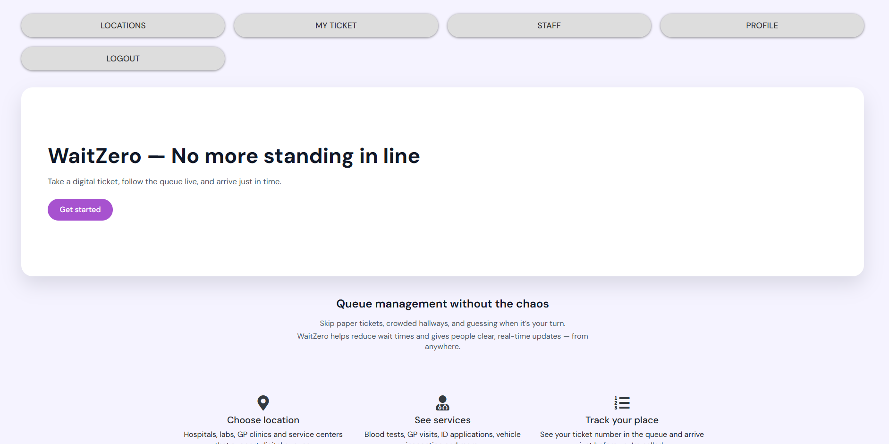

# WaitZero — Cloud-based digital customer service platform with no physical waiting

Customers receive real-time updates about their queue position and can arrive just in time — without standing in line.

## About the Project

In many clinics, labs and public service centers people still physically wait for their turn.

WaitZero helps:

- reduce waiting in crowded areas  
- give people real-time queue updates  
- make staff workflows easier and more organized  

---

## Tech stack

- Java 17  
- Spring Boot  
- Spring MVC + Thymeleaf  
- **Gradle**
- MySQL  
- Spring Data JPA  
- Bootstrap + custom CSS  

---

## Features

- Browse locations and services  
- Registered users can take digital tickets  
- Each user can have only one active ticket  
- Live queue status and estimated waiting time  
- Staff panel – call next ticket  

---

## Roadmap (next steps)

- Dockerize the application  
- Add GitHub Actions CI pipeline  
- Deploy to Azure App Service  
- Add tests (unit + integration)  
- Improve UI/UX

## Installation & Run

1. Clone the repository:
   ```bash
   git clone https://github.com/Boryana-Mihaylova/WaitZero.git
   cd WaitZero
   ```

2. Configure your database credentials in `application-secrets.properties` (this file is excluded via `.gitignore`):
   ```properties
   DB_USERNAME=your-db-username
   DB_PASSWORD=your-db-password
   ```

3. Run the application:
   ```bash
   ./gradlew bootRun
   or
   gradlew.bat bootRun
   ```

4. Access in browser:
   ```
   http://localhost:8080
   ```

---

## Screenshots

### Authentication

**Index Page (Welcome)**  


**Register Page**  


**Login Page**  


---

### Home Pages

**User Home Page**  


**Admin Home Page**  

