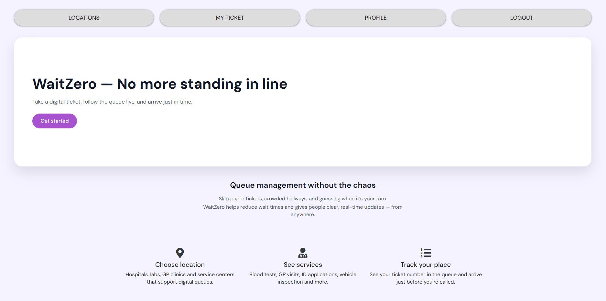
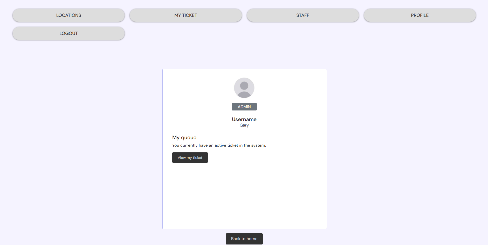
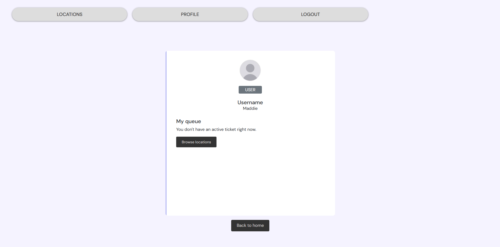
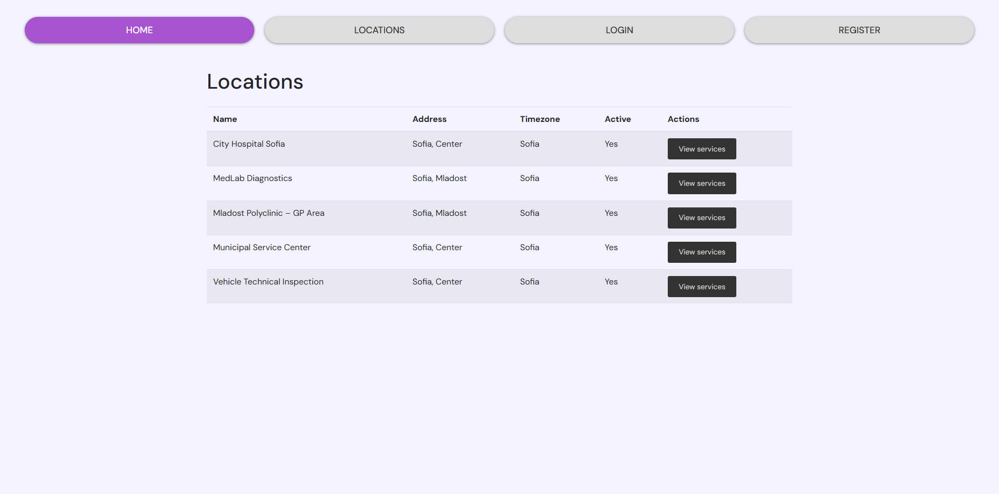
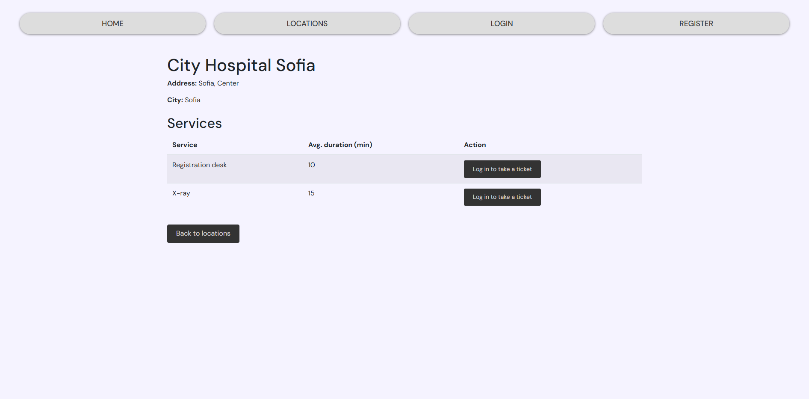
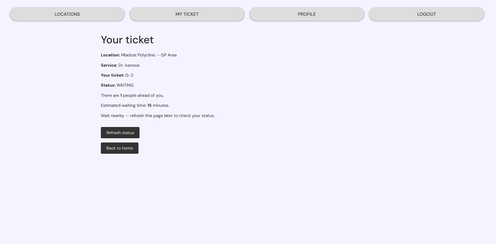
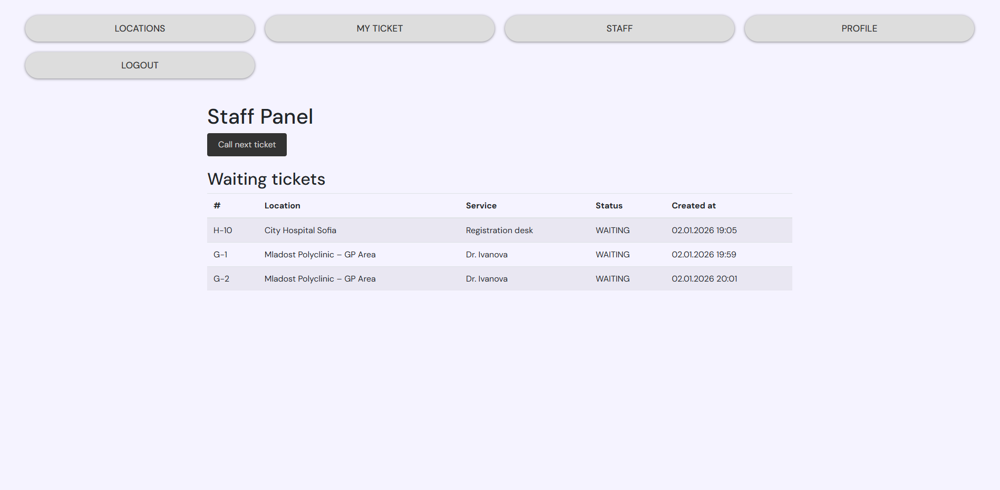

# WaitZero 
Digital customer service platform — no waiting in line

Customers receive real-time updates about their queue position and arrive just in time — without wasting time.


## About the Project

In many clinics, labs and public service centers people still physically wait for their turn.

WaitZero helps:

- reduce waiting in crowded areas  
- give people real-time queue updates  
- make staff workflows easier and more organized

The application has been deployed as a live demo with a cloud database and real-time ticket flow, later adapted to an in-memory setup for the public demo.

---

## Live Demo

The application is deployed and available online:
> Note: The demo runs on Render free tier.  
> If the service has been idle, the first request may take up to ~2–3 minutes to start.

👉 https://waitzero-demo.onrender.com

You can create your own user account via the Register page and test the full ticket flow.

---

## Demo Notes

The application was previously deployed with an external Azure PostgreSQL database during the free credit period.  
The updated live demo runs on Render free tier using an in-memory H2 database.  
Data may persist for some time while the application is running, but can be reset when the service restarts or becomes idle.

---

## Demo Admin

Use the demo admin account to access the staff panel and manage the queue.

- **Username:** admin  
- **Password:** admin123  
- **Staff panel:** /staff/panel
---

## Tech stack

- Java 17  
- Spring Boot  
- Spring MVC + Thymeleaf  
- Gradle  
- Spring Data JPA  
- PostgreSQL (Azure Database for PostgreSQL, previous production setup)  
- Flyway (DB migrations)  
- H2 (in-memory demo database)  
- Docker  
- GitHub Actions (CI/CD)  
- Render (hosting)  
- Bootstrap + custom CSS  
  
Originally developed with MySQL, later migrated to PostgreSQL for production

---

## Features

- Browse locations and services  
- Registered users can take digital tickets  
- Each user can have only one active ticket  
- Live queue status and estimated waiting time  
- Staff panel – call next ticket
---

## Deployment & Architecture

The application runs as a Docker container on Render.

On each deployment, the container is built from the Dockerfile and started with environment-based configuration.
Render provides a dynamic `PORT` which is used by Spring Boot.
Flyway automatically applies database migrations on startup when a relational database is configured.

The current public demo uses an in-memory H2 database to ensure stable and cost-free availability.

---

### Architecture (production-like, previous setup)

Browser  
  ↓ HTTPS  
Render Web Service (Docker container)  
  - Spring Boot (PORT env var)  
  - /health endpoint  
  ↓ JDBC (SSL)  
Azure Database for PostgreSQL  
  - Flyway migrations on startup
    
    

### Architecture (current demo)

Browser  
  ↓ HTTPS  
Render Web Service (Docker container)  
  - Spring Boot  
  - In-memory H2 database  
  - /health endpoint

---

### CI/CD & Deployment

GitHub (`demo/h2-render` branch)  
  ↓ push  
GitHub Actions (build & tests)  
  ↓  
Render (builds Docker image from Dockerfile & deploys)  
  ↓  
Running demo service

---

## Roadmap 

**Security**:
- Spring Security (form login, role-based access)

**Product**:
- Improve UI/UX
---

## Installation & Run

This setup describes running the application locally with a relational database.

1. Clone the repository:
   ```bash
   git clone https://github.com/Boryana-Mihaylova/WaitZero.git
   cd WaitZero
   ```

2. Configure your database credentials in `application-secrets.properties` (this file is excluded via `.gitignore`):
   ```properties
   DB_USERNAME=your-db-username
   DB_PASSWORD=your-db-password
   ```

3. Run the application:
   ```bash
   ./gradlew bootRun
   or
   gradlew.bat bootRun
   ```

4. Access in browser:
   ```
   http://localhost:8080
   ```

---

## Screenshots

### Authentication

**Index page (welcome)**  


**Register page**  


**Login page**  


### Home pages

**User home page**  


**Admin home page**  


### Profile

**Profile (admin view)**  


**Profile (user view)**  



### Ticket management

**Locations page**  


**Services page (login required)**  


**My ticket page**  


**Staff panel**  



---

## License

This project is licensed under the MIT License - see the [LICENSE](LICENSE) file for details.
